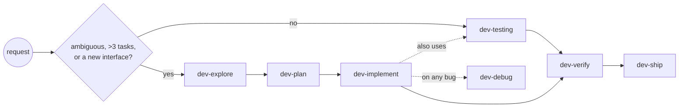

# dev-workflow

A development workflow as nine portable skills: five phases plus four support skills, each with a written criterion for when to skip it.

## Layout

```
dev-workflow/
├── AGENTS.md          # the router: phase table, skip criteria, three global rules
├── README.md
└── skills/
    ├── dev-explore/       analysis — facts in parallel, decisions in rounds
    ├── dev-plan/          spec → tasks with interface contracts
    ├── dev-implement/     direct, or one sub-agent per task with a ledger
    ├── dev-verify/        evidence → spec compliance → fresh review
    ├── dev-testing/       the test discipline
    ├── dev-debug/         reproduce → root cause → the fix that deletes
    ├── dev-ship/          work-unit commits, size budget, integration
    ├── dev-agents-md/     keep the repo's agent instruction file honest
    └── dev-skills/        maintain this set
```

One `SKILL.md` per skill, no supporting files.

## How it routes



Each phase states in its own frontmatter when to skip it. The criteria are countable — files touched, number of tasks, whether a new interface appears.

## Install

```
curl -fsSL https://raw.githubusercontent.com/andresdigiovanni/dev-workflow/main/install.sh | bash
```

This asks which agent(s) to configure — Claude Code, Codex CLI, OpenCode, multiple choice — and whether to install globally (your home directory) or into the current project. It then puts every skill where that agent looks for skills, and adds a block to that agent's instruction file (`CLAUDE.md` for Claude Code, `AGENTS.md` for Codex CLI and OpenCode) with the phase table and routing rules from this repo's own `AGENTS.md`.

To target a specific project directory, or skip the interactive menu:

```
curl -fsSL .../install.sh | bash -s -- --agents claude,codex,opencode --scope global
curl -fsSL .../install.sh | bash -s -- --agents claude --scope project --dir /path/to/repo
```

`--agents` also accepts `all`. `--help` lists every option.

If you already have this repository checked out, `./install.sh` works the same way from inside it.

Running install again — with the same or different agents — updates an existing install in place: skills are refreshed and the instruction-file block is replaced, without touching anything else already in that file.

## Uninstall

```
curl -fsSL https://raw.githubusercontent.com/andresdigiovanni/dev-workflow/main/install.sh | bash -s -- --uninstall
```

Or, non-interactively:

```
curl -fsSL .../install.sh | bash -s -- --uninstall --agents all --scope global --yes
```

This removes the installed skills and the block added to the instruction file. Anything else in that file — anything you or another tool put there — is left exactly as it was. If a skill folder was changed by hand so it no longer matches what was installed, it's left in place with a warning instead of being deleted.

Uninstalling needs an internet connection, the same as installing. Without one, remove the `dev-*` folders from wherever the skills were installed and delete the block between `<!-- dev-workflow:start -->` and `<!-- dev-workflow:end -->` in the instruction file.

## Artifacts

| What | Where | Git |
|---|---|---|
| Spec | `docs/specs/YYYY-MM-DD-<slug>.md` | committed — travels with the PR |
| Plan | `docs/plans/YYYY-MM-DD-<slug>.md` | committed — argues from the spec |
| Ledger | `.dev-runs/<slug>.md` | git-ignored — tracks progress through a plan, task by task |

Add `.dev-runs/` to the target repository's `.gitignore`. A convention the target repository already has wins over these defaults.
