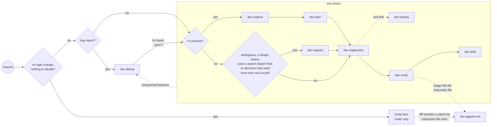

# dev-workflow

A development workflow as nine portable skills: five phases plus four support skills. Every phase that can be skipped carries a written criterion for when.

## Layout

```
dev-workflow/
├── router.md          # the router: lanes, four global rules, git
├── install.sh         # installs the skills and the router block
├── README.md
└── skills/
    ├── dev-explore/       analysis — facts in parallel, decisions in rounds
    ├── dev-plan/          spec → tasks with interface contracts
    ├── dev-implement/     direct, or one sub-agent per task with a ledger
    ├── dev-verify/        evidence → spec compliance → fresh review
    ├── dev-testing/       the test discipline
    ├── dev-debug/         reproduce → root cause → the fix that deletes
    ├── dev-ship/          one commit per task, size budget, integration
    ├── dev-agents-md/     keep the repo's agent instruction file honest
    └── dev-skills/        maintain this set
```

One `SKILL.md` per skill, with two reference files read only when needed: `dev-implement/references/delegated.md`, the plan-execution mode, read only when there is a plan, so small changes don't load it; and `dev-testing/references/property-based.md`, read only once a property test is worth writing.

## How it routes


```mermaid
flowchart LR
    req((request)) --> trivial{"no logic change,<br/>nothing to decide?"}
    trivial -->|yes| tlane["trivial lane<br/>router only"]
    trivial -->|no| bug{"bug report?"}
    bug -->|yes| debug[dev-debug]
    bug -->|no| big{"&gt;3 commits?"}
    debug -->|"fix found:<br/>size it"| big

    subgraph anyphase[any phase]
        big -->|yes| explore_p[dev-explore] --> plan[dev-plan] --> implement[dev-implement]
        big -->|no| unclear{"ambiguous, a design choice,<br/>code a search doesn't find,<br/>or decisions that need<br/>more than one round?"}
        unclear -->|yes| explore[dev-explore] --> implement
        unclear -->|no| implement

        implement -.->|test first| testing[dev-testing]

        implement --> verify[dev-verify] --> ship[dev-ship]
    end

    verify -.->|triage hits the<br/>instruction file| agentsmd[dev-agents-md]
    tlane -.->|diff touches a name the<br/>instruction file uses| agentsmd
    anyphase -.->|unexpected behavior| debug
```

The router names five lanes; the first that fits wins. `router.md` is the authority — this table is a summary:

| Lane | When | Path |
|---|---|---|
| Trivial | no logic changes and nothing to decide: typo, docs, comments, copy, a config value the request states exactly | runs from the router alone, no skill loaded: branch, edit, suite and linter (not for docs nothing builds or tests), scope trace, instruction-file search, commit, report, ask how to integrate |
| Bug | a bug report or unexpected behavior | `dev-debug`, then the lane the fix's size picks — never Trivial; its reproduction test is that lane's failing test |
| Fast | clear request, findable code, 3 commits or fewer, every open question fits in one round and no answer would change the approach | `dev-implement` → `dev-verify` → `dev-ship` |
| Explored | 3 commits or fewer, with ambiguity, a design choice with more than one defensible answer, open surfaces that need more than one round, or code a search doesn't find | `dev-explore` → fast lane |
| Planned | more than 3 commits | `dev-explore` (spec, approaches with their trade-offs) → `dev-plan` → delegated `dev-implement` → `dev-verify` → `dev-ship` |

`dev-verify` scales its gates to the diff: at 50 changed lines or fewer, tests excluded, with no new surface and no plan, its review is a self-run pass instead of a sub-agent. A request that changes no file, such as a question, doesn't enter the workflow.

The work stops for the user only on the decisions listed in the router's rule 3: an open surface, a new dependency the request doesn't name, a fact only the user holds, a behavior the request left with two readings, a go-ahead on spec and plan (or on a restated request when an answer changed the scope), two failed fixes, and how to integrate. Everything else is decided and recorded.

Three things hold across the lanes:

- **Tests first, proven.** Every test is watched fail before the code that turns it green; a regression test is proven red by reverting its fix; a mutation pass shows the new tests assert something. On every lane that loads `dev-implement`, the suite runs once before the first edit, so a pre-existing red is told apart from one the change caused.
- **Only what was asked.** A new surface — an endpoint, a CLI command or flag, an exported function or type, a config key — must justify itself against a requirement — in `dev-explore`, or in `dev-implement`'s single round of questions on the fast and bug lanes — unless the request already names it with its exact shape. `dev-verify` then traces every hunk and every surface back to the spec or the request, and reverts what traces to nothing.
- **Tests aren't bent to pass.** `dev-verify` traces every edit to an existing test — a changed expectation, a loosened assertion, a skip, a deletion — to a requirement that changed that behavior, and reverts the rest.

One task, one commit: a task is committed once its tests pass and its review is through, so history is never rewritten. Commit messages stay short; the request, decisions and progress live in a git-ignored ledger and in the PR body. A plan runs in one worktree when the main tree is busy, with its tasks executed one at a time — parallel sub-agents are reserved for read-only fact-finding.

## Install

```
curl -fsSL https://raw.githubusercontent.com/andresdigiovanni/dev-workflow/main/install.sh | bash
```

This asks which agent(s) to configure — Claude Code, Codex CLI, OpenCode, multiple choice — and whether to install globally (your home directory) or into the current project. It then puts every skill where that agent looks for skills, and adds a block to that agent's instruction file (`CLAUDE.md` for Claude Code, `AGENTS.md` for Codex CLI and OpenCode) with the lanes and global rules from this repo's `router.md`.

To target a specific project directory, or skip the interactive menu:

```
curl -fsSL .../install.sh | bash -s -- --agents claude,codex,opencode --scope global
curl -fsSL .../install.sh | bash -s -- --agents claude --scope project --dir /path/to/repo
```

`--agents` also accepts `all`. `--help` lists every option.

If you already have this repository checked out, `./install.sh` works the same way from inside it.

Codex CLI skills go to `~/.agents/skills` (or `.agents/skills` in a project). If an earlier version of this installer put them in `.codex/skills`, delete the `dev-*` folders there.

Running install again — with the same or different agents — updates an existing install in place: skills are refreshed and the instruction-file block is replaced, without touching anything else already in that file.

## Uninstall

```
curl -fsSL https://raw.githubusercontent.com/andresdigiovanni/dev-workflow/main/install.sh | bash -s -- --uninstall
```

Or, non-interactively:

```
curl -fsSL .../install.sh | bash -s -- --uninstall --agents all --scope global --yes
```

This removes the installed skills and the block added to the instruction file. Anything else in that file — anything you or another tool put there — is left exactly as it was. Skills you edited by hand are overwritten on install and removed on uninstall; a folder with the same name that isn't one of these skills is left in place with a warning.

Uninstalling through `curl` needs an internet connection, the same as installing; `./install.sh --uninstall` from a checkout doesn't. Without either, remove the `dev-*` folders from wherever the skills were installed and delete the block between `<!-- dev-workflow:start -->` and `<!-- dev-workflow:end -->` in the instruction file.

## Artifacts

| What | Where | Git |
|---|---|---|
| Spec | `docs/specs/YYYY-MM-DD-<slug>.md` | committed, only when a plan follows |
| Plan | `docs/plans/YYYY-MM-DD-<slug>.md` | committed — argues from the spec |
| Ledger | `.dev-runs/<slug>.md` | git-ignored — the request and decisions of a change that asked or decided anything, and a plan's progress task by task |

Whichever skill writes the ledger first — `dev-explore` or `dev-implement` — makes sure `.dev-runs/` is git-ignored before writing it. A convention the target repository already has wins over these defaults.
